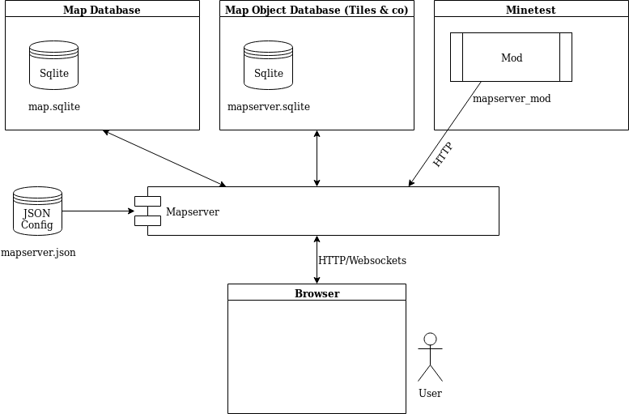

# System overview



# Build dependencies

## Basic
* go >= 1.11
* make

## With crosscompiling (optional)
Either apt-get:
* gcc-mingw-w64
* gcc-5-arm-linux-gnueabihf
* gcc-i686-linux-gnu

Or use the docker-builder image in `/docker-builder`

# Development setup

Working directory: `./server`

## Preparing the files and map

Copy your `map.sqlite` into the working directory if you want to test with
a sqlite map database

### world.mt

You need a `world.mt` too in order to make the connection to the database.
In the sqlite case:

```
gameid = minetest
backend = sqlite3
creative_mode = false
enable_damage = false
player_backend = files
```

For postgres:
```
gameid = minetest
backend = postgresql
creative_mode = true
enable_damage = true
player_backend = postgresql
pgsql_connection = host=localhost port=5432 user=postgres password=enter dbname=postgres
pgsql_player_connection = host=localhost port=5432 user=postgres password=enter dbname=postgres
```

## Generate the static files (webserver vfs)

* Create the vfs (in `vfs/static.go`) with `go generate`

## Running the server

* Create a `mapserver.json` with `go run . -createconfig`
* Change the value `webdev` in the `mapserver.json` to `true`
* Start the server with `go run .` or with debug output: `go run . -debug`
* The web files in `static/` can now be changed on the fly without restarting the server

# All platform build

Prerequisites:
* docker
* make

Building:
* Run `make clean all` to build for all supported targets

The artifacts should now be in the `output` directory

# Release build

Prerequisites:
* docker
* go >= 1.11
* make
* valid github token in `.releasetoken`

Building:
* Run `./release.sh <version>`
