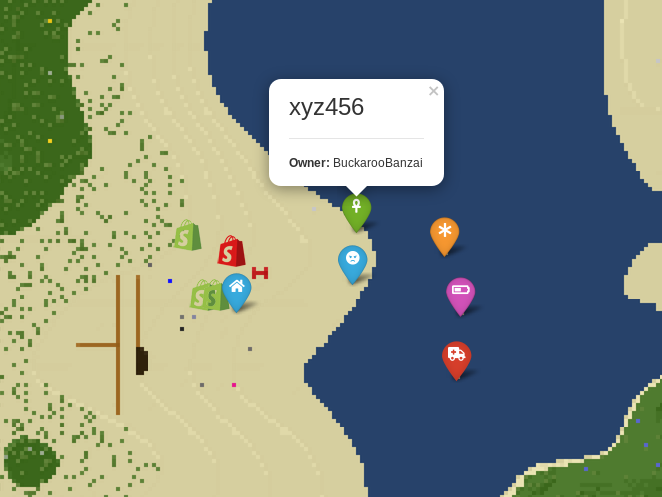
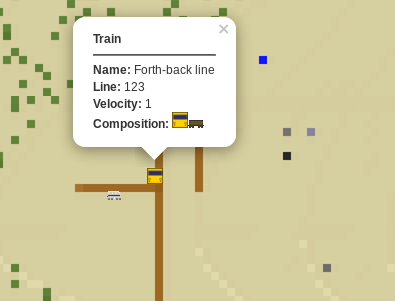

# Supported map objects (markers)

## Player bones

## Digiterms
See: https://github.com/Pyrollo/digiterms

## Digilines
See: https://github.com/minetest-mods/digilines

## POI

All supported icons: https://fontawesome.com/icons?d=gallery&s=regular,solid&m=free

## Protector

## Travelnet
See: https://github.com/Sokomine/travelnet

## Trains from advtrains

## More
And various more, see: [setup.go](../server/mapobject/setup.go)
