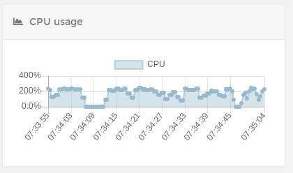
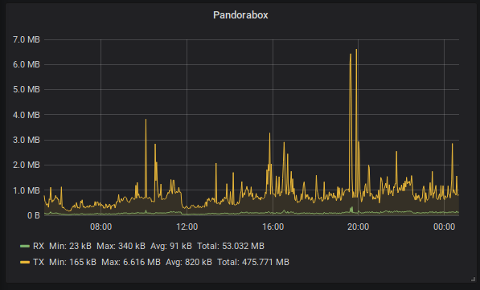

# Recommended specs

Recommended specs for running the mapserver

## Storage

The tiles are cached in several zoom-levels on disk.
Storage usage depends heavily on map-size and explored areas
but it will be in the region of several gigabytes (5 to 10 GB for "older" servers)

## Memory

Memory depends on the amount of caching (see: [Configuration](./config.md))
Per default there will be around 500 mapblocks cached for quicker access.
This will be around 5 to 10 megabytes depending on the contents.

The recommendation is to maximize caching so the queries don't slow down the game-database.
If you are willing to spend around 2 GB of memory set the `maxitems` to 5000 mapblocks.
Otherwise leave the defaults and see if it has any impact.

Example config from `mapserver.json`:
```json
{
        "mapblockaccessor": {
                "expiretime": "10s",
                "purgetime": "15s",
                "maxitems": 500
        }
}
```


## CPU

The application is more CPU-bound than IO-bound.
It will use all the configured CPU's while rendering:



It is recommended to set the `renderjobs` setting to a number of CPU's
you can spare.

Per default it will set the setting to the number of cores you have,
but it will also run on just 1 job and take a bit longer...

Example config from `mapserver.json`:
```json
{
 "renderingjobs": 2
}
```

## Database

The recommended database is Postgres if you have a busy server.
SQLite will work too if the disk-access is good.

**Personal experience**: Don't worry about it if you have fast SSD's ;)

## Network

I don't recommend serving the map behind a slow residential internet connection.
An upload-bandwidth from 10 MBPS upwards will do the job pretty ok though:



# Recap

If your setup looks something like this, don't worry about performance:

* 4+ cores
* 8+ GB RAM
* 20+ GB SSD
* Postgres DB

