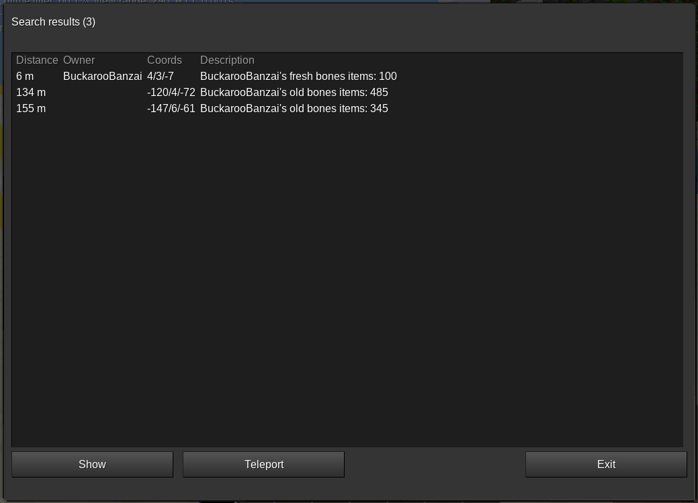

# Search bar

Searchable objects:
* Shops (with stock info)
* POI's
* Trainstations
* Travelnets

Example:


# Ingame search

The ingame-search is enabled if the mapserver active mode is configured.

Commands:

```
/search bones SomeDude
/search bones *
/search shop papyrus
/search shop *
```

Result (Exmple):

