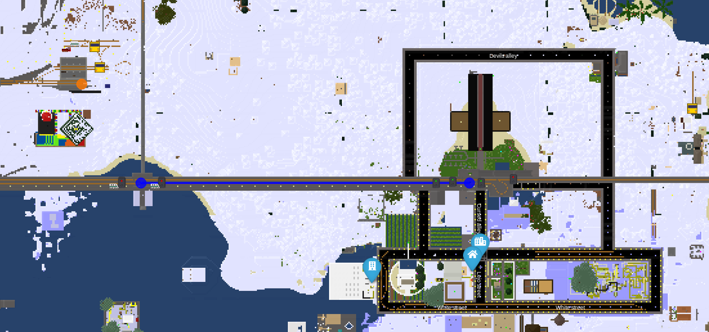
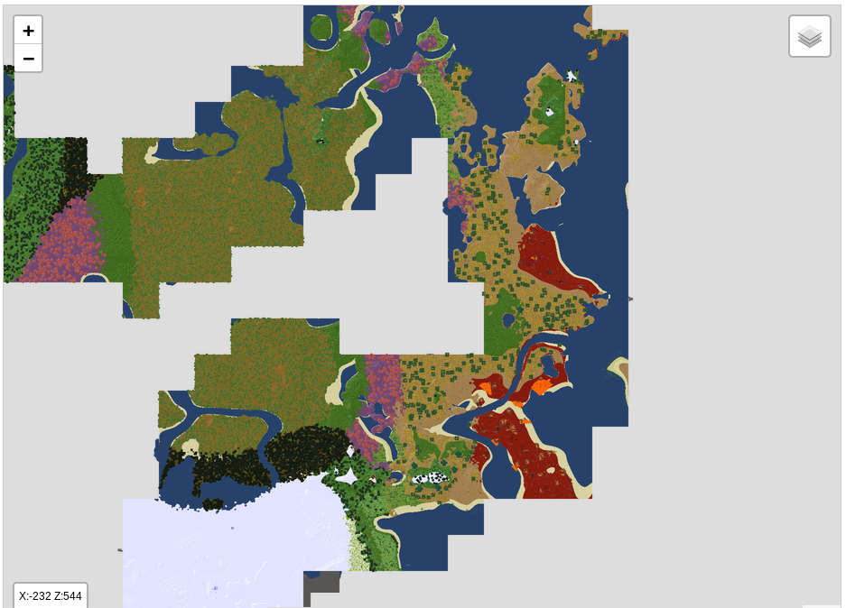

Minetest mapserver
=======

Realtime mapserver for [Minetest](https://minetest.net)

Demo: [Pandorabox Server map](https://pandorabox.io/map/#-1782.25/493.5/10)

# Documentation

* [Installation](doc/install.md)
* [Building](doc/building.md)
* [Mapserver mod](doc/mod.md)
* [Parameters](doc/params.md)
* [Search](doc/search.md)
* [Configuration](doc/config.md)
* [Recommended specs](doc/recommended_specs.md)
* [Stats webfragment](doc/stats_webfragment.md)
* [Web API](doc/api.md)
* [Contribution](doc/contrib.md)
* [Development](doc/dev.md)
* [License](doc/license.md)
* [Changelog](doc/changelog.md)

# How it works

See: [Incremental rendering](doc/incrementalrendering.md)

# Compatibility

* Minetest 0.4.15 - 0.4.17.1
* Minetest 5.0

# Features

## Current features

* Click-and-run installation
* Initial and incremental map rendering
* Param2 coloring
* Realtime rendering and map-updating
* Realtime player and world stats
* [Search](doc/search.md) bar
* Configurable layers (default: "Base" from y -16 to 160)
* POI [markers](doc/mapobjects.md) / [mod](doc/mod.md) integration
* Protector display
* LCD Displays as markers
* Monitoring with [Prometheus](doc/prometheus.md)

## Planned Features

* Isometric view
* Skin support
* Route planning (via travelnets / trains)

# Supported map-databases
The connection is auto-detected from your `world.mt`:

* Sqlite3
* PostgreSql

# Screenshots

## Web interface

## Terminal

## Map objects (as markers)
Enable/Disable those in the [Configuration](doc/config.md)
See:  [mapobjects](doc/mapobjects.md)

# Bugs

There will be bugs, please file them in the [issues](./issues) page.
