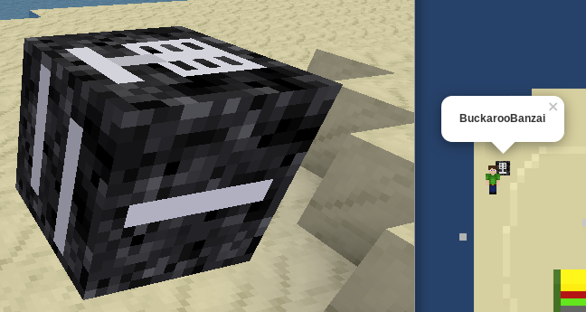
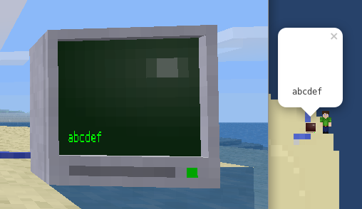
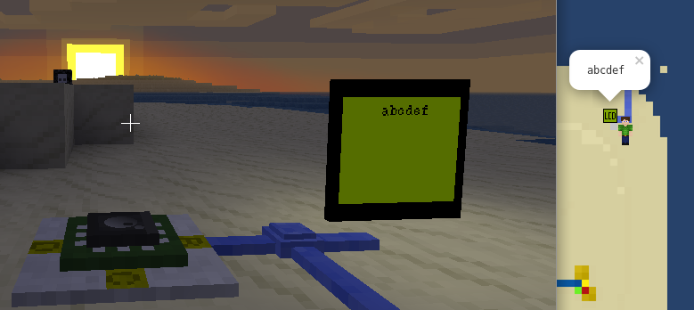
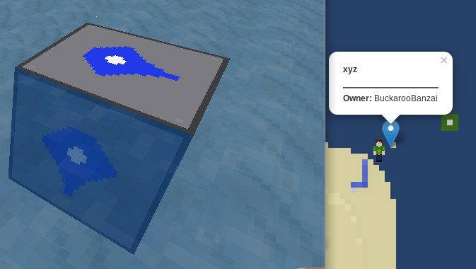
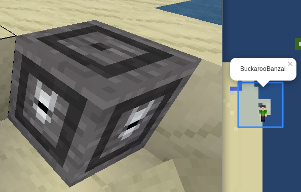
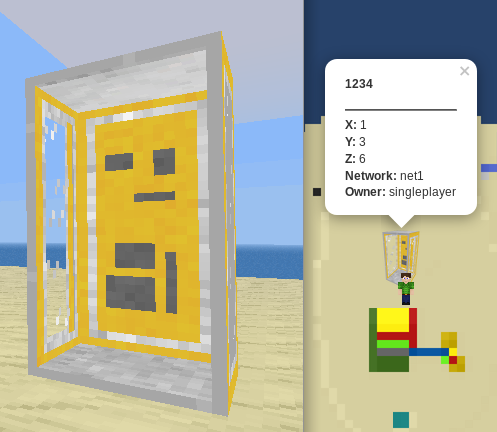

Minetest mapserver
=======

Realtime mapserver for [Minetest](https://minetest.net)

# Documentation

* [Installation](doc/install.md)
* [Mapserver mod](doc/mod.md)
* [Parameters](doc/params.md)
* [Configuration](doc/config.md)
* [Contribution](doc/contrib.md)
* [Development](doc/dev.md)
* [License](doc/license.md)

# Features

## Current features

* Initial and incremental map rendering
* Realtime player and world stats
* Configurable layers (default: "Base" from y -16 to 160)
* POI markers / mod integration
* Protector display
* LCD Displays as markers
* Monitoring with [Prometheus](doc/prometheus.md)

## Planned Features

* Player infos (HP, breath, etc)
* Street names / Train stuff
* City borders

# Supported databases

* Sqlite3 (for map and mapobjects)

# Screenshots

## Web interface

## Terminal

## Map objects (as markers)
Enable/Disable those in the [Configuration](doc/config.md)

# Bugs

There will be bugs, please file them in the [issues](./issues) page.
